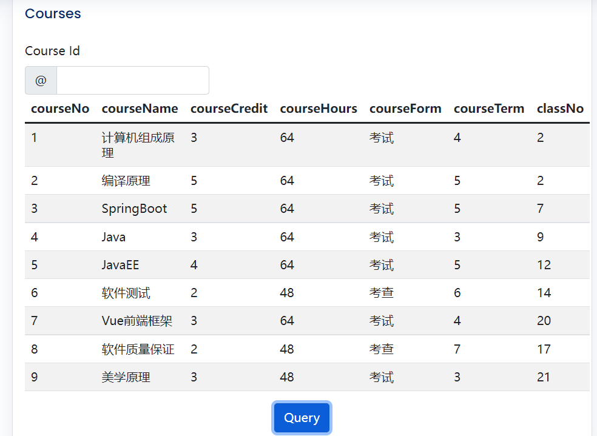
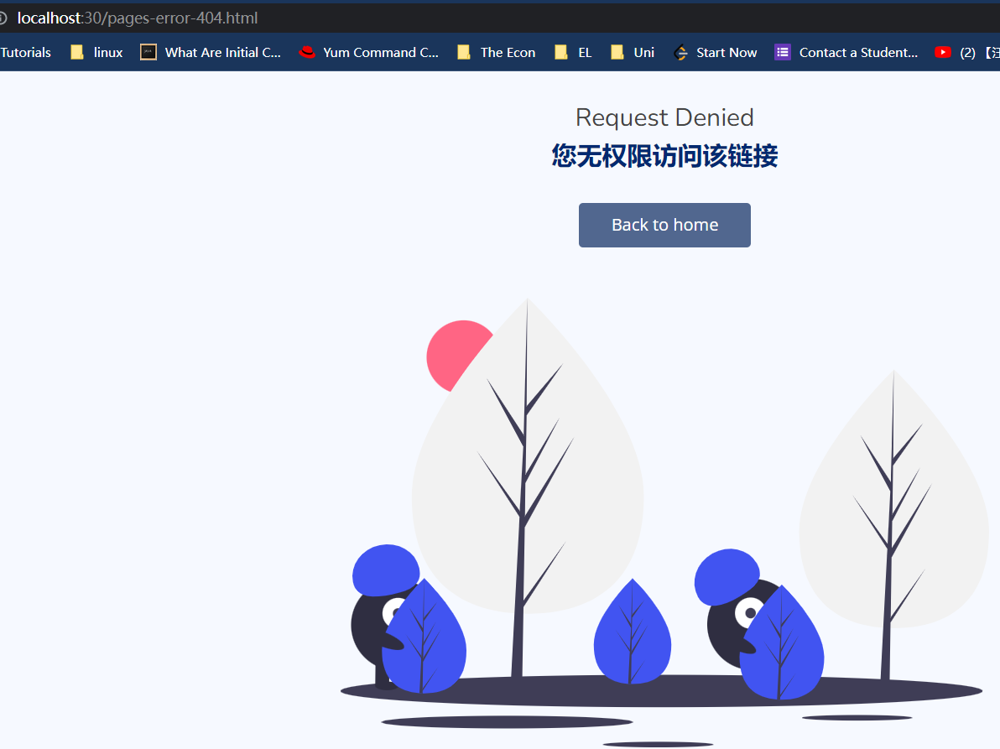

# Uni Management System

---

This web application allows users to view course information, grades for each course, the professor for each course and so on.

Students and administrators have different access to the Management System.

---

---

### Tech Stack:
- 🍃 SpringBoot v2.5.4
  - Utilize Spring Boot auto-configuration, make project launching faster.
  - Integrate third-party technologies such as MyBatis-plus.
  - Serve Restful APIs with Spring MVC with ease.
- MySQL vv8.0.17
- MyBatis v2.2.2
- MyBatis-plus v1.5.1-RELEASE
  - Simplify development of persistence layer with built-in interfaces.
- HTML,JavaScript,CSS3
  - To build customized visual effects.
- Vue2
  - Vue2 is utilized to achieve single-page application. 
- BootStrap5
  - User interface template was adopted.
  - Make web page responsive, compatible with mobile devices.

---

### System Architecture

- Browser(user end) directly interacts with Tomcat.
- Server handles user requests, interact with database, and sends back response to browser.

---

### What it does?

⚠️This project was intended to be developed in bilingual.

⚠️If it causes any confusion, I'm sorry about that.

1. Everyday **CHECK IN**.
> When the COVID-19 hit harshly. The uni requires students to report their health condition on a dayily basis.
> 
> Therefore, we need this feature to efficiently record and organize thousands pieces of data.

2. **Register** and **Login**
> Students and Profs should select different checkbox to register and login. 

3. Query grades and credits

> Administrators can query students' grade and credits by specifying a student number when querying or just query all results.

4. Query courses and corresponding credits.

> Administrators can query all courses information or query one specific course by course Id.

5. Requests from students could be denied because of lack of access.

> Administrators and students have different access to resources.

---
### ER Diagram
> ER diagram design for persistence layer.

  
---
### Entities mapping relationship

